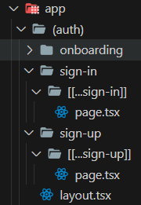

# 😎Next.js로 Thread만들기
유튜브 강의를 통해서 Next.js를 사용해 Thread 사이트를 만들었습니다.
[참고영상](https://www.youtube.com/watch?v=O5cmLDVTgAs)

## 🔧초기세팅
`npx create-next-app@latest .`   
`npm i`   

`npm install @clerk/themes`   
`npx shadcn-ui@latest add form`   
`npx shadcn-ui@latest init`   

## 🧾개념 정리
- TypeScript   
TypeScript는 마이크로소프트에서 개발한 오픈 소스 프로그래밍 언어로, JavaScript의 확장이자 상위 집합 언어이며,      
정적 타입 시스템을 도입하여 개발자에게 코드의 안정성과 가독성을 향상시킬 수 있는 기능을 제공합니다.

- Shadcn   
Shadcn/ui는 재사용 UI 컴포넌트 모음입니다. 이것을 사용해 컴포넌트를 
손쉽게 사용할 수 있습니다.

- Uploadthing   
Uploadthing은 타입스크립트 앱에서 가장 쉬운 파일 업로드 방법입니다.   
이를 사용해 파일을 손쉽게 업로드 할 수 있습니다. 

- Tailwind CSS   
Tailwind CSS는 유연하고 확장 가능한 CSS 프레임워크입니다. 일반적인 CSS 프레임워크와는 달리   
사전 정의된 클래스를 사용하여 스타일을 적용하는 방식으로 작동합니다.   
이 클래스들은 주로 HTML 요소에 직접 적용되어 디자인을 구성하는 데 사용됩니다.

- Clerk   
Clerk는 개발자가 사용자 관리와 인증 기능을 쉽게 구축할 수 있도록 도와주는 플랫폼 중 하나입니다.   
사용자 관리, 인증, 권한 부여, 프로필 관리 등을 간편하게 처리할 수 있는 도구로,   
개발자들이 보다 빠르고 안전하게 사용자 관리 기능을 구현하는 데 도움을 줍니다.

- Zod   
Zod는 TypeScript에서 사용할 수 있는 데이터 검증 및 스키마 정의 라이브러리입니다.   
주로 개발자가 데이터의 유효성을 검사하고 데이터의 형식을 정의하는 데 사용됩니다.   
Zod는 타입 안전성을 제공하면서 런타임에서도 사용할 수 있는 검증을 수행하는 강력한 도구입니다.   

## 🔍주요 기능
[회원가입 & 로그인]   

회원가입과 로그인 기능은 [clerk](https://clerk.com/)를 이용해 작업했습니다.  
<br/> 
   
<br/>
app폴더 안에 (auth) 파일을 만든 뒤, [[...sign-in]]과 [[...sign-up]]폴더를 만듭니다.
```js
import { SignIn } from "@clerk/nextjs";

export default function Page() {
    return <SignIn />
}
```
각 폴더에는 clerk에서 제공하는 모듈만 import하면 회원가입/로그인이 완성됩니다.   
<br/>
<br/>

[프로필 설정]   
회원가입과 로그인이 성공하고, 한 번도 프로필 설정을 하지 않았다면   
/onboarding 페이지로 이동해 사진과 이름 등을 작성합니다.   
만약 이미 프로필을 설정한 적이 있다면 메인페이지로 이동합니다.   
```js
import AccountProfile from "@/components/forms/AccountProfile"
import { fetchUser } from "@/lib/actions/user.actions";
import { currentUser } from "@clerk/nextjs"
import { redirect } from "next/navigation";

async function Page() {
    const user = await currentUser();
    if (!user) return null;

    const userInfo = await fetchUser(user.id);
    if (userInfo?.onboarded) redirect("/");

    const userData = {
        id: user?.id,
        objectId: userInfo?._id,
        username: userInfo ? userInfo?.username : user?.username,
        name: userInfo ? userInfo?.name : user.firstName || "",
        bio: userInfo ? userInfo?.bio : "",
        image: userInfo ? userInfo?.image : user?.imageUrl,
    }

    return (
        <main className="mx-auto flex max-w-3xl flex-col 
        justify-start px-10 py-20">
            <h1 className="head-text">Onboarding</h1>
            <p className="mt-3 text-base-regular text-light-2">
                Complete your profile now to use Threads
            </p>

            <section className="mt-9 bg-dark-2 p-10">
                <AccountProfile user={userData} btnTitle="Continue" />
            </section>
        </main>
    )
}

export default Page
```   
<br/>
<br/>

[스레드 작성]   
clerk에서 현재 유저 정보를 가져온 뒤, 그 값을 PostThread 컴포넌트에   
전달합니다. 이 때 유저 정보가 없다면 null을 반환하고 로그인 페이지로   
이동합니다.   
```js
import PostThread from '@/components/forms/PostThread';
import { fetchUser } from '@/lib/actions/user.actions';
import { currentUser } from '@clerk/nextjs';
import { redirect } from 'next/navigation';

async function Page() {
    const user = await currentUser();

    if (!user) return null;

    const userInfo = await fetchUser(user.id);

    if (!userInfo?.onboarded) redirect('/onboarding');

    return (
        <>
            <h1 className="head-text">Create Thread</h1>
            <PostThread userId={userInfo._id} />
        </>
    )
}

export default Page;
```

PostThread의 디자인은 shadcn의 컴포넌트를 불러와서 사용했습니다.   
<br/>
<br/>

[리플 작성]   
상위 컴포넌트에서 받아온 Props 데이터를 Comment 컴포넌트에서 설정합니다.   
```js
interface Props {
    threadId: string;
    currentUserImg: string;
    currentUserId: string;
}

const Comment = ({ threadId, currentUserImg, currentUserId }: Props) => { ...나머지 코드 }
```   

useForm 함수를 호출하고 이전에 만들어 둔 Zod 스키마를 사용해 검증을 수행합니다.    
댓글 작성은 onSubmit 콜백 함수를 만들어 댓글 정보를 해당 스레드에 추가하고,
완료되면 form필드를 비웁니다.   
```js
const form = useForm({
        resolver: zodResolver(CommentValidation),
        defaultValues: {
            thread: '',
        }
    });

    const onSubmit = async (values: z.infer<typeof CommentValidation>) => {
        await addCommentToThread(threadId, values.thread, JSON.parse
            (currentUserId), pathname);

        window.alert('리플이 작성되었습니다.');
        form.reset();
    }
```   
<br/>
<br/>

[커뮤니티 기능]   
커뮤니티 기능 역시 clerk에 있는 `OrganizationSwitcher` 모듈을 사용해 만들었습니다.   
```js
<OrganizationSwitcher
    appearance={{
        baseTheme: dark,
        elements: {
            OrganizationSwitcher:
                "py-2 px-4"
        }
    }}
/>
```   

## 😋트러블슈팅
<details>
    <summary>
    Unhandled Runtime Error   
    Error: ClerkInstanceContext not found
    </summary>

    - 문제 원인   
    
    <html lang="en">
        <body className={inter.className}>
            {children}  
        </body>
    </html>   
    ClerkProvider 태그로 감싸야지 사용이 가능한데, 아무것도 감싸지 않아서 오류발생
    
    - 문제 해결

    <html lang="en">
        <ClerkProvider>
            <body className={inter.className}>
                {children}  
            </body>
        </ClerkProvider>
    </html>
    문서를 참조해 태그로 감싸면 해결
</details>
<br />
<details>
    <summary>
    조건문 미활용 시 리다이렉트 이슈
    </summary>

    - 문제 원인   
    
    `userInfo?.onboarded`의 값이 `false`인 경우, `redirect('/onboarding')`로 리다이렉트 하는데, 함수가 반환하는 값이 null이거나 `undefined`인 경우 조건문이 작동 하지 않을 수 있다.   
    
    - 문제 해결

    ```js
    const userInfo = await fetchUser(user.id);
    if (!userInfo || !userInfo.onboarded) {
        redirect('/onboarding');
        return null; // 리다이렉트 이후 추가 코드 실행 방지
    }
    ```
    리다이렉트를 수행하기 전에 `userInfo`값이 유효한지 확인하면 된다.
</details>

## 📎사이트

인증 서비스 - [clerk](https://clerk.com/)   
파일 업로드 - [uploadthing](https://uploadthing.com/)   
배포 - [vercel](https://vercel.com/)   


## 📘스택
<div>
  <a href="#"></a>
  <a href="#"></a>
  <a href="#"></a>
  <a href="#"></a>
  <a href="#"></a>
</div>
